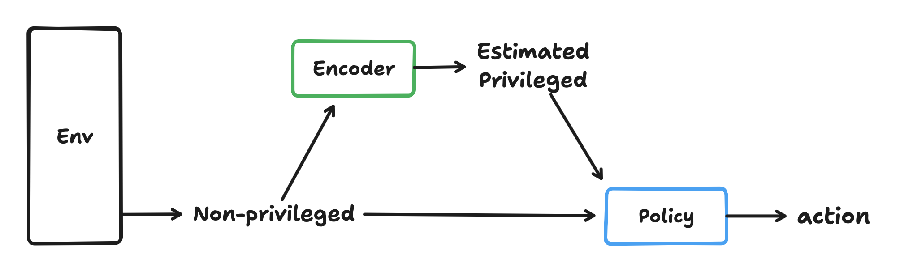

# Privileged learning

Privileged learning is a sim2real approach that uses only the simulation environment and does not require real-world data collection.

In privileged learning, information is divided into two types: privileged information and non-privileged information. Privileged information is difficult to obtain in the real world due to sensor limitations or costs, and it is only available in the simulation environment. Non-privileged information consists of data that can be collected in real-world production.

This approach provides two advantages:

* Sim2real without real-world data
  * Good interpretability due to the state estimation

### **Methods**

<figure><figcaption></figcaption></figure>

A privileged learning method typically consists of two components: a estimator and a policy. The policy is learned using privileged information, which contains rich features about the task. Policies can utilize this information to learn faster and perform better. However, since privileged information is not available in the real world, the policy cannot be directly deployed. This is where the estimator comes in. The estimator recovers privileged information from non-privileged data, allowing the policy to be deployed in real-world.

**Approaches**

There are generally three approaches to learn the policy and estimator.

* Learn the estimator and the policy separately (also called teacher-student approach)
* Learn the estimator and the policy jointly
* Multi-stages learning

### **Learn Separately (Teacher-student approach)**

* _Related works_
  * previous work
  * robot dog papers, etc

Separating the policy and estimator is easy to use and maintain in a complex robotic system.

However, the performance of the policy and estimator is highly coupled. This results in the following issue:

* The policy is not robust against the weaknesses of the estimator's imperfections, as it is unaware of them.

In this scenario, the policy may execute an undesired control sequence that would not occur with perfect state estimation, such as in stochastic dynamics.

<figure><figcaption></figcaption></figure>

### **Learn Jointly**

* _Related works_
  * [EcRL](https://app.heptabase.com/55124100-54a8-470a-a743-87cb33e45d9f/card/d107af4e-bc5d-4de1-b58b-c0d22e91ad4f), \[[EcRL series](https://aidx-lab.org/manipulation/)]

To address the policy's lack of awareness regarding estimator perfection, the joint learning approaches enable the RL policy to explore and exploit the weaknesses of the estimator while avoiding them.

### **Multi-stage**

* _Related works_
  * Student-informed teacher training

### **Design choice**

#### **Tips**

* learn the encoder on the policy rollout with encoder output, which prevent the distribution shifts in policy observation from oracle state to the estimated state

#### **Potential issues**

* Privileged information could be partially observable from non-privileged information, leading to unavoidable estimation error
  * connect to RL POMDP cases?

### References

* Learn estimator and policy separately
* Learn estimator and policy jointly
* multi-stages learning
